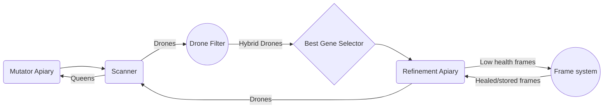

# Introduction

This project implements a genetic optimization algorithm running on in-game programmable computers (via the OpenComputers mod) inside the modpack GregTech: New Horizons (GT:NH). It automates the selective breeding of bees, which in GT:NH have heritable genetic traits that affect in-game resource production. This system converges on the optimal trait combination across generations with no manual intervention beyond initial setup.

At its core, the system functions as a multi-stage genetic algorithm: it maintains a population of candidates, scores each one against a fitness function (desired traits and species), selects the highest-quality individuals for breeding, and feeds offspring back into the pool. All logic runs on in-game computers communicating with physical automation blocks via a component network.

This version targets the HV (High Voltage) progression tier, which is when in-game computers first become available.


# Prerequesites

 - GregTech: New Horizons modpack (HV tier or above)
 - Access to OpenComputers components (Redstone card)
 - Access to an Apiary, Scanner, and Transposers in-game
 - Oblivion Frames (recommended for optimal breeding speed)

# System Overview

The diagram below shows the full data flow of the system — from introducing new genetic material, to scanning and filtering candidates, to refining the best individuals each generation.



`Mutator Apiary:` Crossbreeds two parent species to introduce a target hybrid into the gene pool. Functionally, this is the **mutation/crossover** stage of the algorithm.

`Scanner:` Reads each bee's genetic traits via the OpenComputers component network to determine its fitness score and whether it has achieved hybrid status. This is the **evaluation** stage.

`Drone Filter:` Routes non-hybrid bees back to the Mutator and forwards confirmed hybrids downstream for further refinement. This is the **selection filter**.

`Best Gene Selector:` Acts as the **fitness function** — scoring the pool of hybrid candidates and pairing the highest-quality individual with a queen for the next breeding cycle.

`Refinement Apiary:` The core **breeding loop** — breeds the selected pair and feeds offspring back into the scanner to re-enter the gene pool each generation.

`Frame System:` Manages consumable breeding accelerants (Oblivion Frames), automatically replacing depleted ones to keep the breeding loop running at maximum throughput.
#Installation

# Usage
Place a OpenComputers computer in your setup with an internet card.
Run the following command in the computer terminal to download the script:
```
   wget https://github.com/jkerns128/GregTech-New-Horizons-Automated-Bee-Breeding-System/edit/main/README.md
```
Configure the transposer addresses and block orientations inside AIpiary.lua to match your physical setup (see System Setup below).

```AIpiary.lua``` runs the whole system, you will need to set some of the addresses for the transposers and keep in mind the orientation of the blocks when placing your system. <br />

### Arguments
The program has 4 arguments, 3 of which are required <br /><br />

``targetType``: The type of the first bee type that is being used for breeding. For breeding Windy bees this would be written as "Windy" <br />
``firstQueenType``: The type of the first bee type that is being used for breeding. For breeding Windy bees this would either be "Supernatural" or "Ethereal" (Supernatural bees + Ethereal bees = Windy bees) <br />
``secondQueenType``: The type of the second bee type that is being used for breeding. For breeding Windy bees this would either be "Supernatural" or "Ethereal" <br />
``effect``: The desired effect on the resulting bee, the system will prioritize breeding bees that have this type. default: "None" <br />


## System Setup
This video goes over all of the parts of the system more in-depth. <br />

[](https://youtu.be/KSrcwvrrfcc?si=Fo8rvJ5OF9nfvns5)


# Future Improvements
A configuration system is planned to simplify transposer direction setup, making the physical installation process easier for new users.

Beyond that, a longer-term goal/project that would be interesting to see is the automatic discovery of unbreed species, allowing the system to autonomously queue and breed them without any manual intervention. This would be backed by an in-game bee database, which is fully possible within the modpack.

